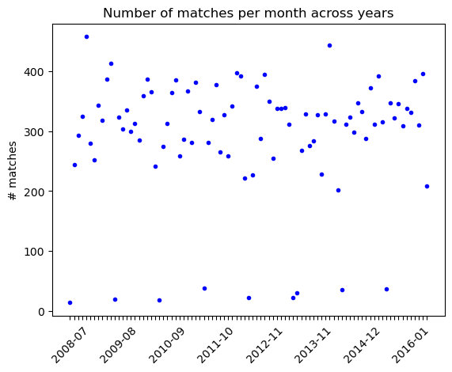
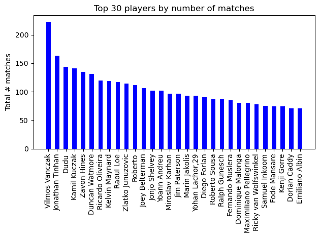
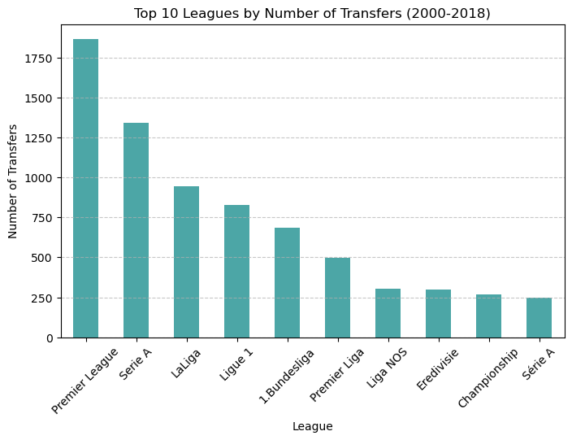
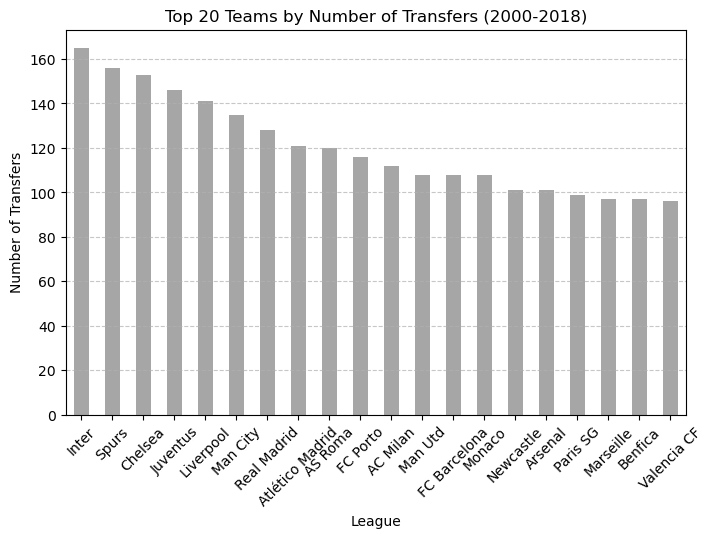
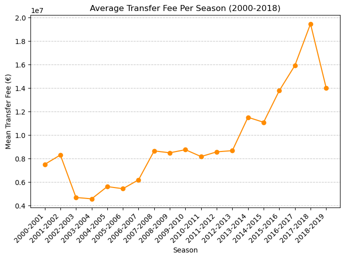

# Milestone 1 

## **Dataset**

Football is the most popular sport in the world. In this project, we will focus on male football players and match statistics in Europe.

We use two publicly available datasets from Kaggle. The first records all match history from seasons 2008 to 2016, covering over 25,000 matches with detailed statistics, including teams, lineups, and in-game events such as goal types, possession, corners, crosses, fouls, and cards. The second dataset documents football transfers from 2000 to 2018, listing player movements along with their transfer fees, market values, and origin/destination clubs. 

- **Mathien**, “European Soccer Database”, 2017.  
   [Dataset Link](https://www.kaggle.com/datasets/hugomathien/soccer)

- **Slehkyi**, “Football transfers 2000-2018”, 2018.  
   [Dataset Link](https://www.kaggle.com/code/slehkyi/football-transfers-2000-2018)

These two datasets are widely recognized and of high quality, as confirmed by verified feedback. We ensured this by applying basic preprocessing steps and exploring the general data structure through initial visualizations (more details in the Exploratory Data Analysis section).

## **Problematic**

**Overview**:
In modern football, transfers play a crucial role in shaping team success, financial stability, and league competitiveness. Every season, clubs invest heavily in new signings, player development, and strategic transfers to strengthen their squads.  This project aims to analyze football match statistics and player transfers across different leagues and seasons. We will explore detailed match data, player movements, and transfer fees to uncover key trends and assess the impact of transfers on team performance. By studying these factors, we seek to understand how transfers influence team dynamics, squad strength, and overall league competitiveness.

**Motivation**:
Our goal is to provide a clear visual representation of match performance and transfer activity, enabling a deeper understanding of player market trends and their effects on club success. By examining historical data, we can highlight patterns in transfer spending, team strategies, and the financial evolution of the sport.

**Target Audience**:
This visualization could be beneficial for:
- **Football clubs & managers** → Assessing transfer market trends and optimizing team-building strategies.
- **Medical professionals & sports scientists** → Identifying patterns in match statistics and transfer impact.
- **Fans & analysts** → Gaining insights into player transfers, team performance, and financial trends in football.

## **Exploratory Data Analysis**

- **European Soccer Database**

This dataset is presented as a .sqlite file, containing several tables. The main tables that we will use are “PLAYER” (~11k entries), “MATCH” (~29k entries), “LEAGUE” (11) and “TEAM” (299). We mention that not all unique players are present in the “MATCH” table, some preprocessing will be done to remove them. Additionally, we provide the two following charts to show the distribution of the number of matches per months across years, which is pretty homogenous, and the top players with the largest amount of matches played.

<table align="center">
  <tr>
    <td align="center">
      
    </td>
    <td align="center">
      
    </td>
  </tr>
</table>

- **Football transfers 2000-2018**

The dataset is well-structured in CSV format, requiring no preprocessing. It contains 4,700 transfers recorded between 2000 and 2018, with 10 columns providing detailed information about each transfer.  
The dataset includes the following attributes:  

   - **Player Name**: The name of the transferred football player.  
  - **Selling Team & League**: The club and league the player is transferred from.  
  - **Buying Team & League**: The club and league the player is transferred to.  
  - **Market Value**: The estimated market value of the player at the time of transfer.  
  - **Transfer Fee**: The actual amount paid for the transfer.  
  - **Player Position**: The position in which the player primarily plays.  
  - **Season**: The season when the transfer occurred.  

To better understand the dataset, we conducted Exploratory Data Analysis (EDA). The following visualizations provide an overview of key trends in market dynamics over time, including transfer activity and fee distributions.

<table align="center">
  <tr>
    <td align="center">
      
    </td>
    <td align="center">
      
    </td>
  </tr>
  <tr>
    <td align="center" colspan="2">
      
    </td>
  </tr>
</table>

  For a detailed analysis, refer to our Jupyter Notebook:  
  <a href="analysis.ipynb">Exploratory Data Analysis Notebook</a>

## **Related work**

**Existing Studies & Insights**  

From a first research following studies have already been performed: 
- **General trends in player transfers** among the top 5 European leagues (Serie A, Bundesliga, Premier League, LaLiga, Ligue 1).  
- **Transfer fees as a function of player age**, analyzing how market value fluctuates based on a player's career stage.  
- **Key factors influencing match outcomes**, using in-depth match statistics to predict results. *(Source: Soccer Database by Sheema Masood, Kaggle)*.  

While these studies provide valuable insights, our approach is different: we aim to go beyond basic transfer statistics by analyzing: 
 - **The relationship between player transfers and team performance**, assessing how new signings impact squad success.  
- **Trends in transfer fees over time**, identifying key financial shifts and market inflation.  
- **Patterns in club strategies**, highlighting how different teams approach transfers based on past success and spending habits.  

Our initial source of inspiration came from this website : [World in Maps - Europe](https://worldinmaps.com/europe/). As it showed how plotting things from a different angle gave a different impression of a metric. The spatial representation of Europe encouraged discussions about football within our group, ultimately sparking the idea for this project.

