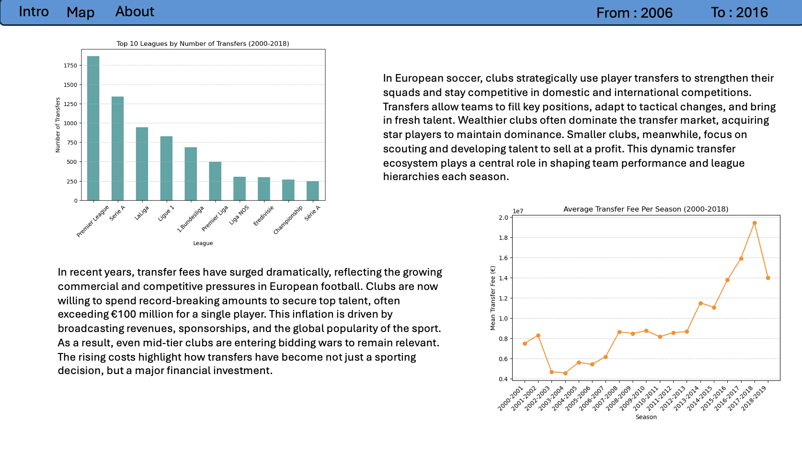
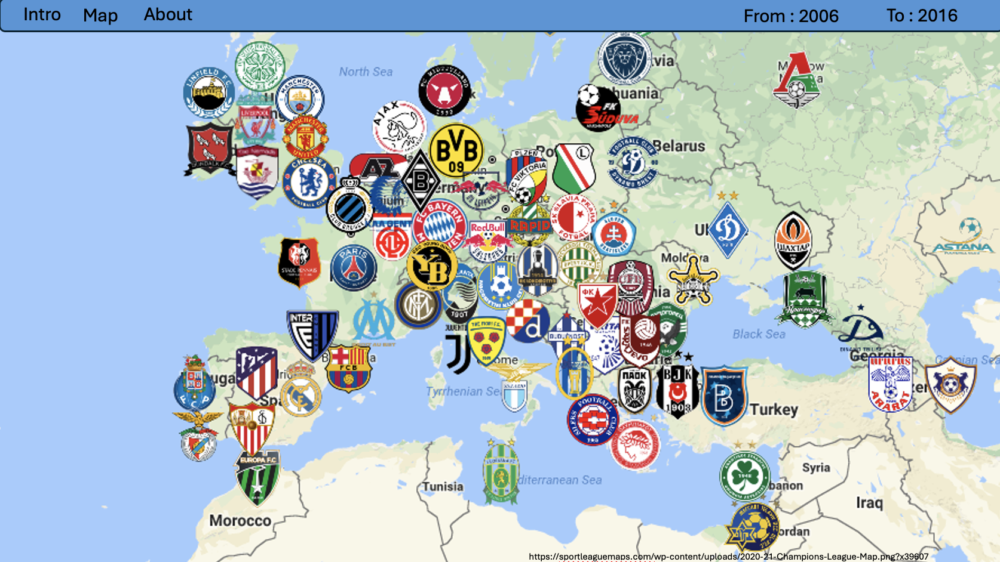
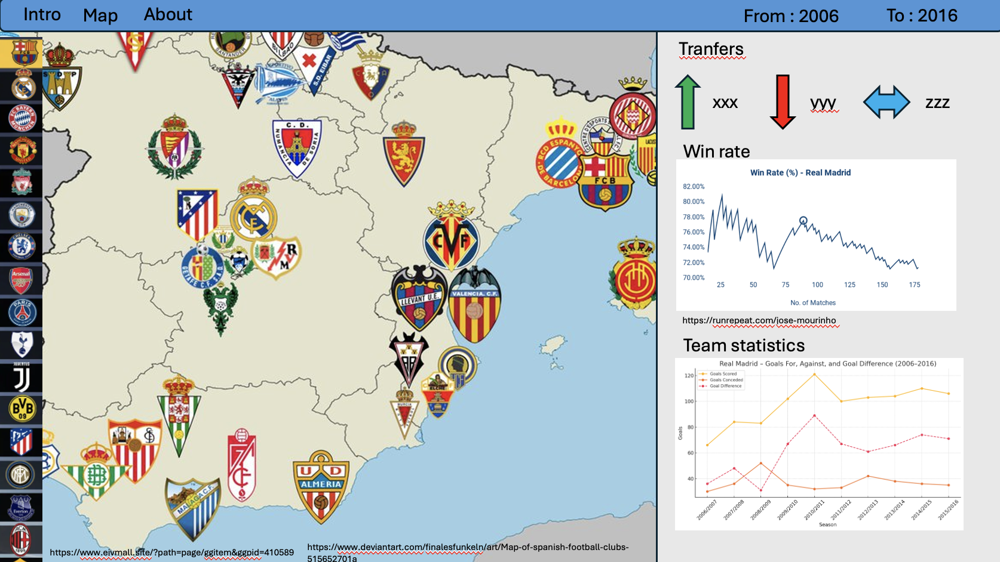
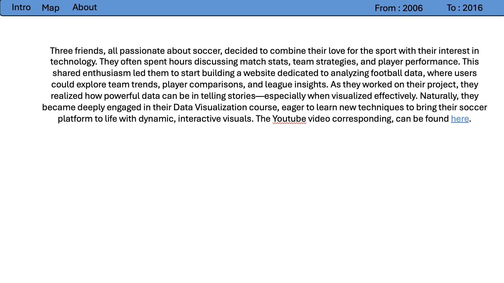

# Milestone 2 

Data Visualization Project — COM-480
Date: April 18, 2025

## Presentation

As indicated in Milestone 1, our project focuses on the most popular sport in European culture: football. Specifically, we analyze data concerning male football players and clubs from 2006 to 2016. Leveraging two high-quality datasets—one on match statistics and the other on player transfers—we aim to explore how clubs and their performance evolved during this period.

Our objective is to visualize how player transfers influence team performance, and how financial factors shape competitive success. The project offers users an interactive platform to compare teams, observe transfer patterns, and understand spending behavior.

Through maps and team-based visualizations, users can navigate Europe, follow their favorite clubs, and uncover trends in performance, transfers, and expenditures. This platform is designed to serve football fans, analysts, and scouts alike by offering a novel data-driven perspective on the football ecosystem.

## Design sketches 

We began with a brainstorming session and produced the following design sketches to structure our final website layout and content:

<table align="center">
  <tr>
    <td align="center">
      
    </td>
    <td align="center">
      
    </td>
  </tr>
</table>

<table align="center">
  <tr>
    <td align="center">
      
    </td>
    <td align="center">
      
    </td>
  </tr>
</table>

## Tools and Course Concepts

To achieve our design, we’ve identified six key interface components and linked each with the necessary tools and course concepts:
 
- **General**, Initial concept, visual storytelling  
&nbsp;&nbsp;&nbsp;&nbsp;&nbsp;&nbsp;&nbsp;&nbsp;*Course Tools*: Git/GitHub, Design Best Practices, Text Visualization, Storytelling, Perception/Color  

- **Overhead**, Top bar with parameters and navigation  
&nbsp;&nbsp;&nbsp;&nbsp;&nbsp;&nbsp;&nbsp;&nbsp;*Course Tools*: Basic Web Development, Interactions, D3.js  

- **Map**, Geospatial view of clubs and transfers  
&nbsp;&nbsp;&nbsp;&nbsp;&nbsp;&nbsp;&nbsp;&nbsp;*Course Tools*: Maps, Interactions, Leaflet.js  

- **Scrollbar**, Scroll/search feature for club selection  
&nbsp;&nbsp;&nbsp;&nbsp;&nbsp;&nbsp;&nbsp;&nbsp;*Course Tools*: Interactions  

- **Plots**, Visualization of team statistics over time  
&nbsp;&nbsp;&nbsp;&nbsp;&nbsp;&nbsp;&nbsp;&nbsp;*Course Tools*: Graphs, Tabular Data  

- **Side Panel**, Dynamic sidebar with club-specific info  
&nbsp;&nbsp;&nbsp;&nbsp;&nbsp;&nbsp;&nbsp;&nbsp;*Course Tools*: Interactions  

We are using an external dataset to include team logos for visual identity:
- **luukhopman**, “Football Team Logos 2024/2025”, 2024.  
   [Github Repository](https://github.com/luukhopman/football-logos?)

## Initial Challenges 

While implementing the project, we encountered several early-stage obstacles:
    - Data Integration: Aligning team names across different datasets (match stats, transfers, logos) proved more complex than expected due to inconsistencies in naming conventions and historical changes. This required extensive filtering and normalization.

    - Task Allocation: Initially, roles were unclear. A follow-up meeting with clearly defined objectives and task ownership helped improve clarity and focus.

As we have begun working on the project we have faced some initial challenges we ar ein the midst of resolving. 
    - Linking team location to team logo and data. Because of different labelling, changes of european relevance the regrouping of the data per team has taking more time than anticiated. Some rigorous filtering ansd statistical analysis provided solution. 
    - Task attibution. The first task distribution was bad and it was unclear who was responsible for that. A meeting which listed the main objetives and necessary steps to reach them helped in identifying priorities for each collaborator. 

## Future Ideas (Optional Enhancements)

Once our minimum viable product is established, we may explore the following enhancements:
    - **Advanced** **Team** **Analysis**: Correlate transfer activity with team strengths/weaknesses in attack/defense using deeper statistical analysis.
    - **Map**: Enhance transition animations and UI elements in the map visualization.
    - **Filter**: Introduce filters by league, budget, or historical success to facilitate more granular comparisons.

